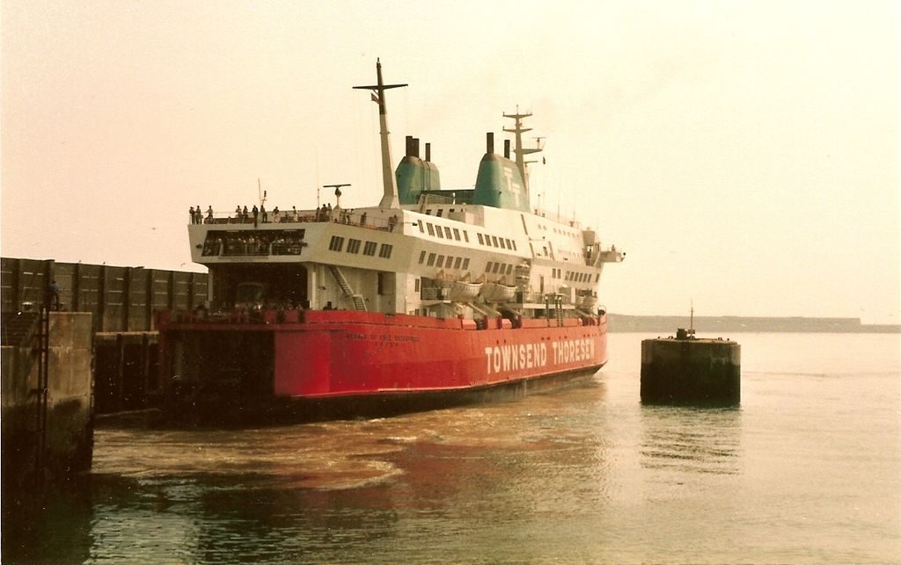

# Tragedi MS Herald of Free Enterprise (1987)

Penampakan kapal ferri MS Herald of Free Enterprise

## Kenapa Insiden Terjadi

Pada Maret 1987. Kapal ferri MS Herald of Free Enterprise terbalik setelah meninggalkan Zeebrugge, Belgia. 193 orang meninggal. Penyebab kecelakaan karena kru kapal lupa untuk menutup pintu lambung, pintu biasa mobil atau kendaraan lain masuk ke kapal ferri. Pintu lambung kapal yang terbuka membuat air, dengan cepat, masuk ke dalam kapal dan membuat kapal terbalik. 

Terdapat dua alasan mengapa kru bisa lupa menutup lambung kapal. Yang pertama adalah kelalaian kru yang bertugas untuk menutup pintu lambung kapal yang terletak di dek G. Mark Stanley, adalah seorang asisten Boatswain (sebuah posisi yang bertanggung jawab terhadap dek kapal) tertidur setelah lelah membersihkan dek G yang juga merupakan tempat mobil parkir. Ia tidak mendengar suara klakson kapal yang menandakan akan berangkat. Umumnya kru harus menutup pintu lambung kapal tepat setelah ikatan kapal (mooring) dilepas untuk berangkat. Selain itu juga, Leslie Sabel, yang merupakan seorang First Officer yang bertanggung jawab untuk bersiaga di dek G untuk memastikan pintu lambung kapal tertutup juga tidak bersiaga di dek G karena ada urusan lain di Bridge (tempat kapal dikendalikan) dan berfikir bahwa ada Stanley yang akan menutup pintu lambung kapal. Terence Ayling yang merupakan seorang Boatswain, yang menurut pengadilan, merupakan kru terakhir di dek G juga tidak menutup pintu lambung dengan alasan itu bukan tugasnya. Yang kedua adalah tidak adanya indikator lampu yang menyatakan pintu lambung kapal sudah tertutup atau tidak pada Bridge sehingga Kapten Kapal David Lewry tidak tahu bahwa pintu lambung kapal tetap terbuka.

ilustrasi pintu lambung kapal

## Kesalahan desain

Yang kami tekankan pada insiden ini adalah kesalahan desain pada kapal, khususnya ketidakadaan lampu indikator pintu lambung kapal pada Bridge yakni tempat di mana kapten kapal bertugas dan kapal dikendalikan. Mungkin lampu indikator pada Bridge tersebut terkesan sepele, sebab sudah ada kru yang bertanggung jawab pada tertutup atau tidak tertutupnya pintu lambung kapal, namun kapten kapal juga memiliki tanggung jawab terhadap kapal secara keseluruhan termasuk tertutupnya pintu lambung kapal karena akan berakibat fatal. 

## Masukan untuk desain yang lebih baik

Berdasarkan permasalahan tersebut, sudah jelas masukan yang tepat adalah dengan menambahkan lampu indikator pintu lambung pada Bridge. Desain Bridge yang menurut kami ideal adalah Bridge yang memiliki lampu indikator yang memadai, termasuk tanda warna yang intiutif seperti warna hijau yang menandakan pintu lambung terbuka dan warna merah menandakan pintu lambung tertutup. Selain itu juga, letak lampu indikator tersebut harus diletakan di daerah yang sering dilihat kru kapal yang bertugas di Bridge, salah satunya adalah tepat di atas setir kapal.

## Mockup UX untuk desain yang lebih baik

Karena dari sisi desain permasalahan ini hanya ketidakadaannya lampu indikator pada Bridge, serta keterbatasan pengetahuan penulis tentang kapal, maka penulis membuat mockup untuk mengoreksi UX pada Bridge MS Herald of Free Enterprise dan menekankan pada lampu indikator pintu lambung kapal, serta pilihan warna sinyal intiutif dan peletakan di daerah yang sering dilihat oleh kru kapal.

## referensi:
- Jorgensen, Per. 2017. *What are some examples of bad design that killed someone?*. Diakses dari: https://www.quora.com/What-are-some-examples-of-bad-design-that-killed-someone#BUiFz. (27 September 2020)
- Wikipedia. 2020. *MS Herald of Free Enterprise*. Diakses dari: https://en.wikipedia.org/wiki/MS_Herald_of_Free_Enterprise. (27 September 2020)
