# Wawancara bersama Petrus Eric

## Ringkasan wawancara

### Years of experience
Wawancara bersama Kak Petrus Eric dilakukan oleh salah satu anggota kelompok kami, Tantyo Nurwahyu T, melalui aplikasi Whatsapp pada Minggu, 27 September 2020, pukul 16.54. Sampai saat ini, Kak Eric sudah menggeluti dunia desain UI/UX selama 3,5 tahun.

### How many design made counted by apps
Untuk jumlah desain yang dibuat, Kak Eric tidak bisa menyebut jumlah pasti karena banyaknya desain tersebut. Namun, berdasarkan tautan portofolio, dan hasil wawancara setidaknya terdapat 21 desain (termasuk desain untuk aplikasi Android Fore Coffee) yang pernah dibuat Kak Eric. Desain-desain tersebut terdiri atas desain untuk aplikasi ataupun website, ada yang hanya untuk proyek iseng-iseng, desain yang tidak terealisasi karena alasan tertentu, maupun sudah yang terealisasi.

### What is designer philosophy during design process
Dalam hal mendesain, Kak Eric mendeskripsikan dirinya bukan lah orang yang teoritis. Kak Eric lebih cenderung mengandalkan pada ilmu praktis dan pengalaman yang dia dapat ketika mendesain atau melihat desain orang lain. Adapun untuk gaya mendesain Kak Eric tidak memiliki aturan baku. Dia cenderung menyesuaikan desainnya dengan brand klien agar citra dan pesan yang dibawakan brand tersebut tersampaikan dengan baik melalui desain yang Kak Eric buat. 

### Get copy to his/her design items
Desain - desain yang pernah dibuat Kak Eric dapat dilihat pada tautan ini: https://xplodedbox.com/portfolio/. Adapun pada tautan tersebut hanya menyimpan sebagian besar desain yang pernah dibuat Kak Eric, tetapi tidak semua, apalagi ada desain yang dianggap rahasia karena permintaan klien. 

### Ask whether he/she had a habit to consider control design (the interaction parts), in case yes give proof
Bagi Kak Eric, seorang desainer UI/UX untuk mengambil tindakan yang berdampak pada User Experience. Namun, terkadang, hal tersebut terhambat karena beberapa alasan tertentu, seperti klien yang bebal, akan bermasalah pada divisi lain, atau hal lainnya. Sebagai contoh pada aplikasi Fore Coffee. Pada awalnya, Kak Eric mendesain tombol "Ambil Sendiri" dengan pertimbangan banyak pelanggan Fore Coffee lebih cenderung untuk pemesanan Dine In. Namun, karena keputusan perusahaan dan situasi pandemi tombol tersebut berubah menjadi "delivery".

## Evaluasi salinan desain

Karena desain yang diberikan cukup banyak, maka kami hanya mencoba mengevaluasi satu desain pada aplikasi Fore Coffee yang dapat diunduh di play store.

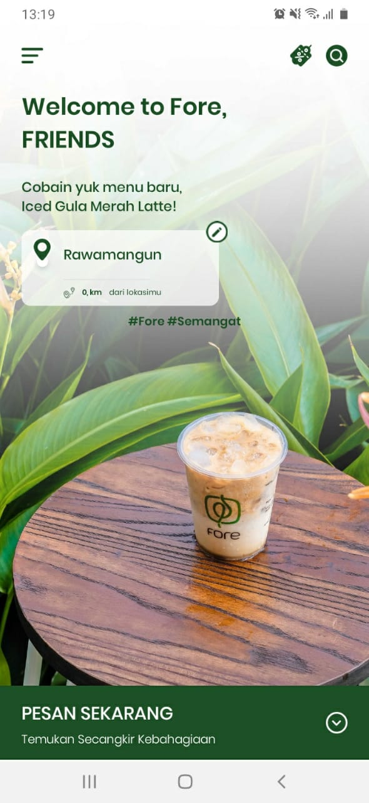

tampilan awal setelah membuka aplikasi.

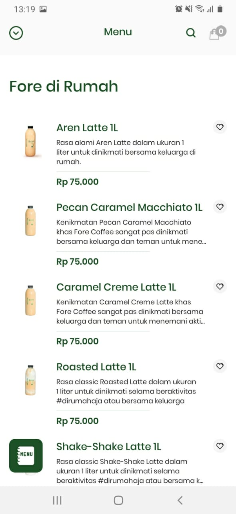

tampilan menu memilih pesanan kopi.

tampialn memilih gerai Fore Coffee.

### evaluasi:
Menurut kelompok kami desain yang dibuat Kak Eric pada aplikasi Fore Coffee sudah bagus, mulai dari pemilihan warna yang sesuai dengan brand Fore Coffee yakni hijau dan putih, serta desain yang nyaman untuk dilihat layaknya image pada kedai kopi pada umumnya yang tidak hanya menjual rasa tetapi juga menjual suasana tempat yang nyaman. Namun, ada dua hal kecil yang menurut kami cukup menganggu. Yang pertama adalah, placeholder pada kolom pencarian di halaman pemilihan gerai. Sebenarnya masalah ini cukup kecil, tetapi sebagai pengguna, hal tersebut cukup menggangu karena warnanya yang hitam pekat seolah - olah kolom pencarian tersebut sudah diisi teks. Yang kedua, menurut kami ini cukup krusial yakni tidak adanya pemberitahuan untuk menyalakan GPS layaknya aplikasi yang membutuhkan lokasi terkini pengguna seperti halnya Gojek atau Grab. 

### koreksi:
berikut adalah mockup koreksi yang kami sudah buat, tidak ada perubahan besar hanya perubahan kecil sesuai permasalahan yang sudah dibahas sebelumnya.

## Bukti wawancara:

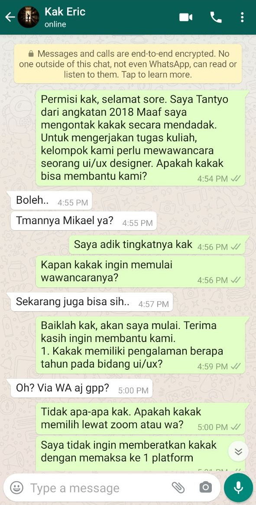
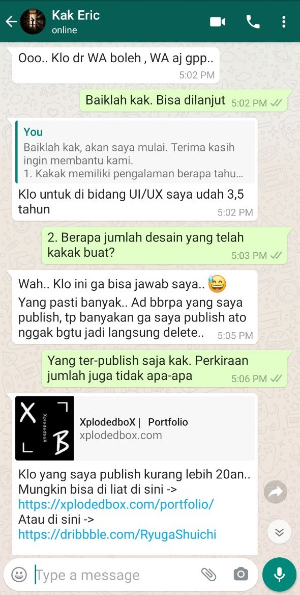
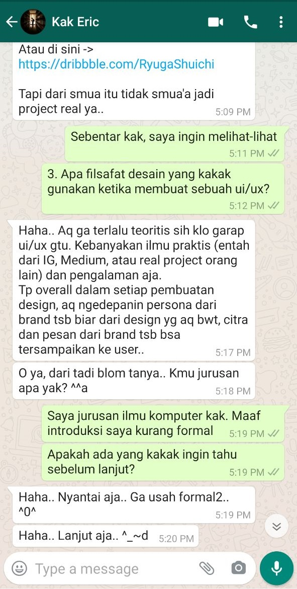
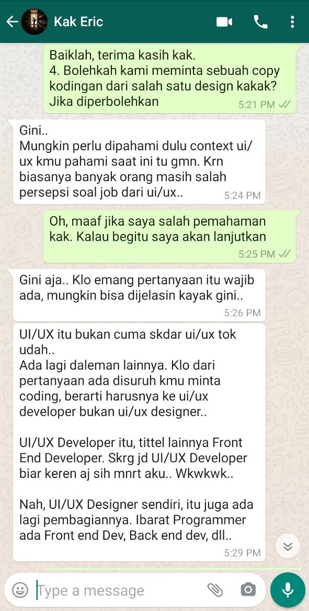
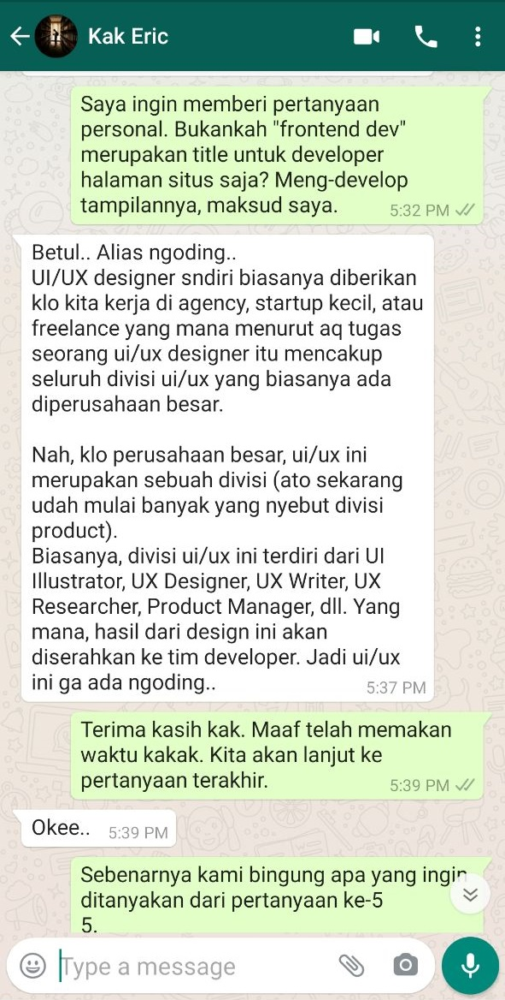
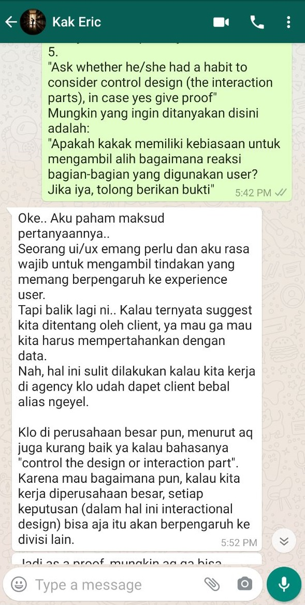
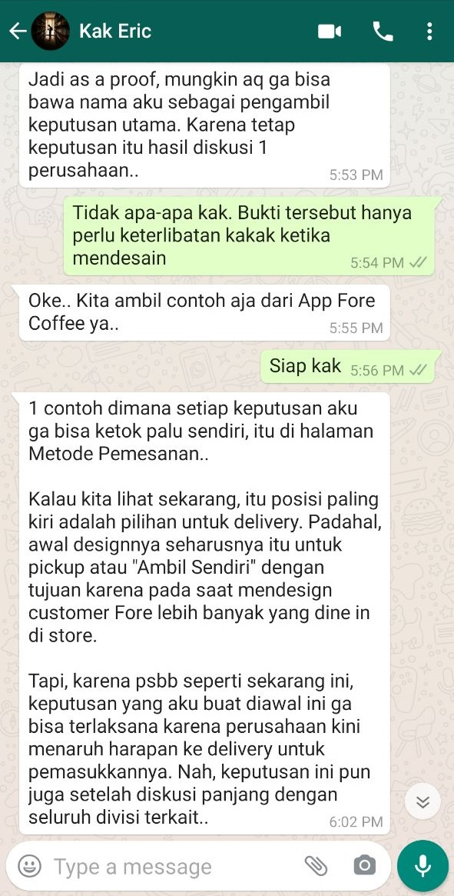
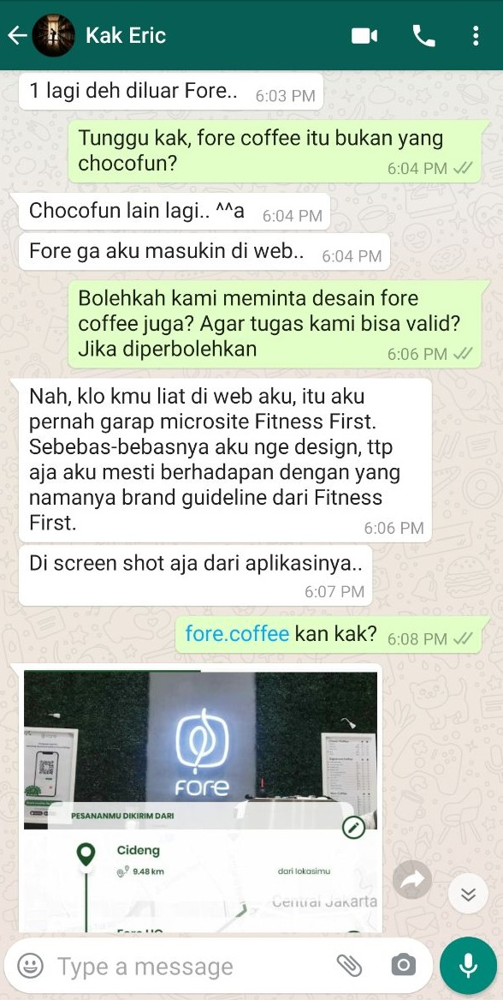
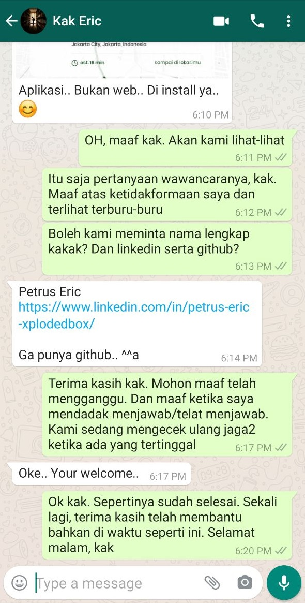
